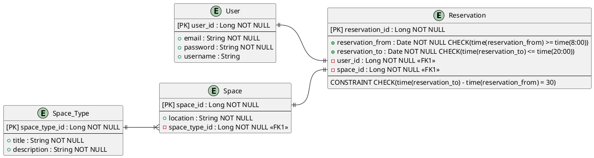

# reservation

## ERD

[View Online](https://www.plantuml.com/plantuml/umla/ZPD1Qy9048Nl-oi6JmO9fEsb11MBRMbHOj5uAgKioMWNacpOZ2rY-j-x6snMOnDwdVVbpPiNTb8GLxHB4vRWXe0aAB7z88Y5meY4p1Z3Z0JjeRV40jKdDyCU71Z0wyli3PITleiOV9ZBR0l18eHWFPzhodKPmE2CsoYPQlAU4zOaJ9yUfhC-YHJxJTQ1yGWgvTRtFCUvC2JvNpkI3WoFPjVUhviBEutyaH-6myVPrNXSCKNE8-o6gcEdYs0LBk-UWx0hXGijjuxWndFOjor-LUqDzpdQtezXI0yxQzSE2MfvHKgS0mE8iOYKoCtgIw8PeBcxUsqY8zxqjKndU5ldIO9rWSe6QFjRTZ-cN2GjP-UyABwaYbjauvtnr9PcSjXVuFlduSlITSi36A2fCPFQzurXJPPmyengZPr-tiBM8fjW5kiN-mC0)



**Format**:
* https://plantuml.com/class-diagram
    * https://plantuml.com/ie-diagram

## Info

This project uses Quarkus, the Supersonic Subatomic Java Framework.

If you want to learn more about Quarkus, please visit its website: <https://quarkus.io/>.

## Running the application in dev mode

You can run your application in dev mode that enables live coding using:

```shell script
./mvnw compile quarkus:dev
```

> **_NOTE:_**  Quarkus now ships with a Dev UI, which is available in dev mode only at <http://localhost:8080/q/dev/>.

## Packaging and running the application

The application can be packaged using:

```shell script
./mvnw package
```

It produces the `quarkus-run.jar` file in the `target/quarkus-app/` directory.
Be aware that it’s not an _über-jar_ as the dependencies are copied into the `target/quarkus-app/lib/` directory.

The application is now runnable using `java -jar target/quarkus-app/quarkus-run.jar`.

If you want to build an _über-jar_, execute the following command:

```shell script
./mvnw package -Dquarkus.package.jar.type=uber-jar
```

The application, packaged as an _über-jar_, is now runnable using `java -jar target/*-runner.jar`.

## Creating a native executable

You can create a native executable using:

```shell script
./mvnw package -Dnative
```

Or, if you don't have GraalVM installed, you can run the native executable build in a container using:

```shell script
./mvnw package -Dnative -Dquarkus.native.container-build=true
```

You can then execute your native executable with: `./target/reservation-1.0.0-SNAPSHOT-runner`

If you want to learn more about building native executables, please consult <https://quarkus.io/guides/maven-tooling>.

## Related Guides

- REST ([guide](https://quarkus.io/guides/rest)): A Jakarta REST implementation utilizing build time processing and Vert.x. This extension is not compatible with the quarkus-resteasy extension, or any of the extensions that depend on it.
- Hibernate ORM ([guide](https://quarkus.io/guides/hibernate-orm)): Define your persistent model with Hibernate ORM and Jakarta Persistence
- JDBC Driver - H2 ([guide](https://quarkus.io/guides/datasource)): Connect to the H2 database via JDBC
- SmallRye OpenAPI ([guide](https://quarkus.io/guides/openapi-swaggerui)): Document your REST APIs with OpenAPI - comes with Swagger UI
- REST Jackson ([guide](https://quarkus.io/guides/rest#json-serialisation)): Jackson serialization support for Quarkus REST. This extension is not compatible with the quarkus-resteasy extension, or any of the extensions that depend on it

## Provided Code

### Hibernate ORM

Create your first JPA entity

[Related guide section...](https://quarkus.io/guides/hibernate-orm)


### REST

Easily start your REST Web Services

[Related guide section...](https://quarkus.io/guides/getting-started-reactive#reactive-jax-rs-resources)
